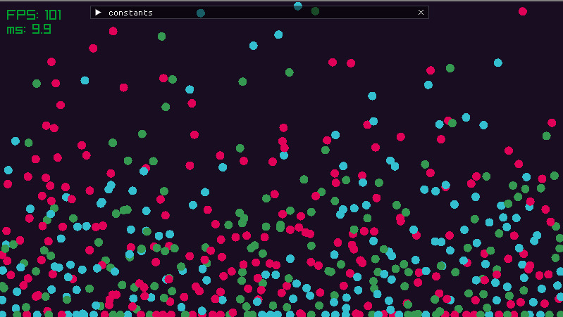

# Particle-Based Viscoelastic Fluid Simulation

It works but it's not perfect.



See it running [there](https://philae-ael.github.io/miniature-fortnight)


Implementation of this paper:
- Clavet, Simon, Philippe Beaudoin, and Pierre Poulin. “Particle-Based Viscoelastic Fluid Simulation.” In Proceedings of the 2005 ACM SIGGRAPH/Eurographics Symposium on Computer Animation, 219–28. Los Angeles California: ACM, 2005. https://doi.org/10.1145/1073368.1073400.

Directories in vendor are submodules. You should either populate them yourself or clone using
```
git clone --recurse-submodules ...
```
